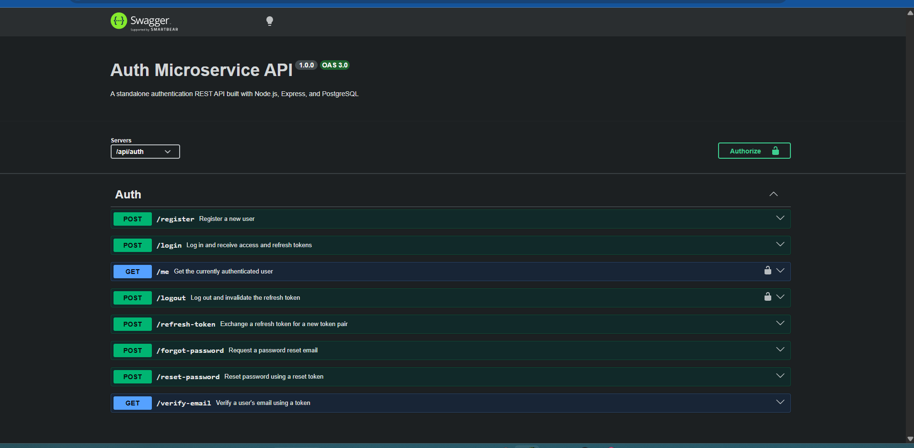

# Auth Microservice



**Live demo:** https://auth-microservice-0shc.onrender.com
**Live API docs:** https://auth-microservice-0shc.onrender.com/api-docs

A standalone authentication REST API built with Node.js, Express, and PostgreSQL. Designed as a plug-and-play microservice that can be integrated into any project requiring user authentication.

## Features

- User registration with input validation
- Email verification on registration
- Login with JWT access and refresh tokens
- Protected routes via Bearer token authentication
- Refresh token rotation
- Secure logout with server-side token invalidation
- Password reset via email
- Rate limiting, security headers, and request logging

## Tech Stack

- **Runtime:** Node.js
- **Framework:** Express
- **Database:** PostgreSQL
- **Authentication:** JSON Web Tokens (JWT)
- **Password Hashing:** bcrypt
- **Email:** Nodemailer
- **Validation:** express-validator
- **Security:** helmet, express-rate-limit

## Project Structure

```
src/
├── config/         # Database connection, environment variables, schema
├── controllers/    # Route handler logic
├── middleware/     # JWT authentication middleware
├── models/         # Database queries
├── routes/         # API route definitions
└── utils/          # Token generation, email helpers
```

## Getting Started

> **Note:** The live demo runs on a free-tier instance and may take up to a minute to respond if it's been idle the first request wakes it up.

### Prerequisites

- Node.js v18+
- PostgreSQL

### Installation

1. Clone the repository

```bash
git clone https://github.com/davidtiger3622/auth-microservice.git
cd auth-microservice
```

2. Install dependencies

```bash
npm install
```

3. Create a `.env` file in the root directory

```
PORT=5000
NODE_ENV=development
DB_HOST=localhost
DB_PORT=5432
DB_NAME=auth_microservice
DB_USER=postgres
DB_PASSWORD=your_postgres_password
JWT_ACCESS_SECRET=your_access_secret
JWT_REFRESH_SECRET=your_refresh_secret
JWT_ACCESS_EXPIRES_IN=15m
JWT_REFRESH_EXPIRES_IN=7d
EMAIL_HOST=smtp.gmail.com
EMAIL_PORT=587
EMAIL_USER=your_email@gmail.com
EMAIL_PASS=your_gmail_app_password
EMAIL_FROM=your_email@gmail.com
```

4. Set up the database

```bash
psql -U postgres -d auth_microservice -f src/config/schema.sql
```

5. Start the development server

```bash
npm run dev
```
## Running with Docker

If you'd rather not install Node.js or PostgreSQL locally, the entire service can run in containers.

### Prerequisites

- Docker Desktop

### Steps

1. Create a `.env` file in the root directory (same variables as the manual setup above)

2. Build and start the app and database together

```bash
docker compose up --build
```

This automatically builds the app image, starts a PostgreSQL container, loads the schema on first run, and starts the API — no manual database setup required.

3. Confirm it's running

```bash
curl http://localhost:5000/health
```

4. Stop the containers

```bash
docker compose down
```

Add `-v` to also remove the database volume and start fresh next time:

```bash
docker compose down -v
```

> **Note:** The Postgres container is exposed on host port `5433` (not `5432`) to avoid conflicts with a locally installed PostgreSQL instance. The app connects to it internally over Docker's network regardless.


## API Endpoints

| Method | Endpoint | Description | Auth Required |
|--------|----------|-------------|---------------|
| GET | `/health` | Check if service is running | No |
| POST | `/api/auth/register` | Register a new user | No |
| POST | `/api/auth/login` | Login and get tokens | No |
| GET | `/api/auth/me` | Get current user | Yes |
| POST | `/api/auth/logout` | Logout and invalidate token | Yes |
| POST | `/api/auth/refresh-token` | Get new access token | No |
| POST | `/api/auth/forgot-password` | Request password reset email | No |
| POST | `/api/auth/reset-password` | Reset password with token | No |
| GET | `/api/auth/verify-email` | Verify email via emailed token | No |

## Request Examples

**Register**
```json
POST /api/auth/register
{
  "email": "user@example.com",
  "password": "SecurePass123"
}

```
**Verify Email**
```
GET /api/auth/verify-email?token=token_from_email
```

**Login**
```json
POST /api/auth/login
{
  "email": "user@example.com",
  "password": "SecurePass123"
}
```

**Protected Route**
```
GET /api/auth/me
Authorization: Bearer your_access_token
```

**Refresh Token**
```json
POST /api/auth/refresh-token
{
  "refreshToken": "your_refresh_token"
}
```

**Forgot Password**
```json
POST /api/auth/forgot-password
{
  "email": "user@example.com"
}
```

**Reset Password**
```json
POST /api/auth/reset-password
{
  "token": "reset_token_from_email",
  "password": "NewSecurePass123"
}
```

## Security Highlights

- Passwords hashed with bcrypt at cost factor 12
- JWT access tokens expire in 15 minutes
- Refresh tokens stored in database and invalidated on logout
- Rate limiting: 100 requests per 15 minutes
- HTTP security headers via helmet
- Input validation and sanitization on all endpoints
- Password reset tokens are single-use and expire in 1 hour
